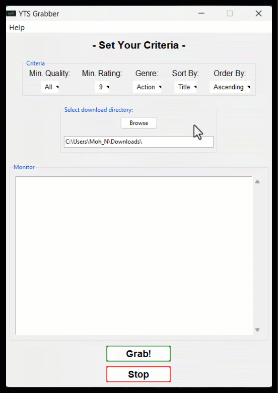

<h1> YTS Grabber</h1>

<h2> Introduction </h2>

Welcome to YTS Grabber! This application allows you to easily fetch and bulk download movies from the YTS.mx website. Whether you're looking for the latest releases or timeless classics, YTS Grabber simplifies the process of finding and obtaining movies according to your preferences.

<h2> Features </h2>

<ul>
  <li>Option to select minimum quality</li>
  <li>Option to select minimum rating</li>
  <li>Option to select genre</li>
  <li>Option for sorting preferences</li>
  <li>Option for ordering preferences</li>
</ul>

<h2>Additional Features:</h2>
<ul>
  <li>Ability to choose the output directory for downloaded movies</li>
  <li>Multithreaded processing for improved performance</li>
  <li>Real-time output display of the grabbing and downloading process</li>
</ul>

<h2>Usage</h2>

<h3>Setting Criteria:</h3>

Choose the desired minimum quality, rating, genre, sorting, and ordering options from the respective dropdown menus.

<h3>Selecting Output Directory:</h3>

Click on the "Output Directory" button to choose a custom directory where downloaded movies will be saved. If no directory is selected, the default Downloads directory will be used.

<h3>Initiating Download:</h3>

Once you've configured your preferences, click on the "Grab!" button to start the process of fetching and downloading movies.

<h3>Monitoring Progress:</h3>

The progress of the grabbing and downloading process will be displayed in real-time within the scrolled text area.

<h3>Stopping the Process:</h3>

If needed, you can stop the process at any time by clicking the "Stop" button.

<h2>Additional Information</h2>
<ul>
  <li><strong>Internet Connection:</strong> Ensure you have a stable internet connection for fetching movie data.</li>
  <li><strong>Disk Space:</strong>Make sure you have sufficient storage space in the selected download directory.</li>
  <li><strong>Interference:</strong> Avoid interfering with the application while a task is in progress to prevent unexpected behavior.</li>
  <li><strong>Feedback and Support:</strong> For any inquiries, feedback, or bug reports, feel free to contact the developer at <a href="mailto:solutionsstudioinbox@gmail.com">solutionsstudioinbox@gmail.com</a>.</li>
</ul>

<h2>About</h2>

Developed by Mohammad Naim Elham.

Version: 2.0 (May 2024).

You may contact developer to help you build your own app

Watch the YouTube tutorial <a href="https://youtu.be/TsZ38iuygDk">here</a>.

Trial version included in this reposository 

Purchase the product <a href="https://naimelham.gumroad.com/l/ytsgrabber">here</a>.

